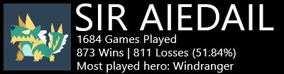
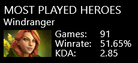

#Dota2Stats

##Thanks to bo1g
He originally created this skin. He didn't update in over two years, so I took over and will now maintain a fixed and more up to date version here until he comes back.

##About the skin
This is a skin for Rainmeter that displays your Dota 2 statistics.
This skin uses data obtained from https://www.dotabuff.com/.

##### Compact core module

##### Full core module

##### Last played match

##### Most played hero

##Installation
Unzip the contents of the zip file into your `%USERPROFILE%\Documents\Rainmeter\Skins` directory and activate the skin in Rainmeter.
Then open Variables.ini located inside the @Resource folder in a text editor such as Notepad and replace the text behind "URL=" with your profile URL.

##Customization
To customize the skin, open Variables.ini found in the @Resources folder in a text editor such as Notepad and follow the instructions there.

##Bugs
* None, at the moment

##Future features
* Addtional modules:
  * Last three matches
  * Three most played heroes
* Customization module:
  * Resize option
* Pack everything into an installer

**I'm open for requests.**
